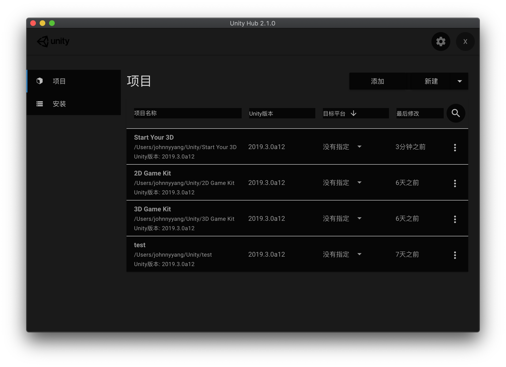

# Unity Hub Dark Mode

## How to

- install asar

`npm i -g asar`

- unpack app.asar file

You can found the `app.asar` file in the `/Applications/Unity Hub.app/Contents/Resources`
`asar extract app.asar app`

- Change the style

Add `DarkUnityHub.css` to `client/dist/index.html` &`client/dist/index-new-project.html`

- Pack you file
  `asar pack app app.asar`

- Replace the app.asar file
