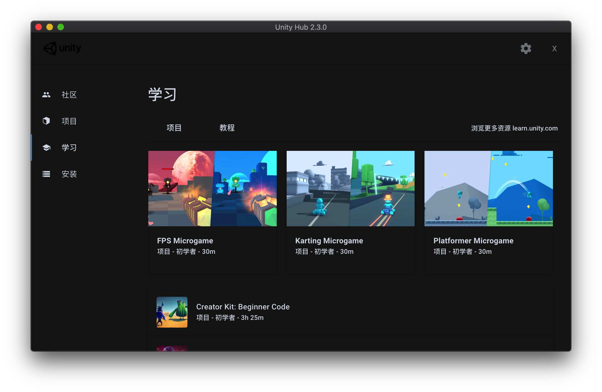
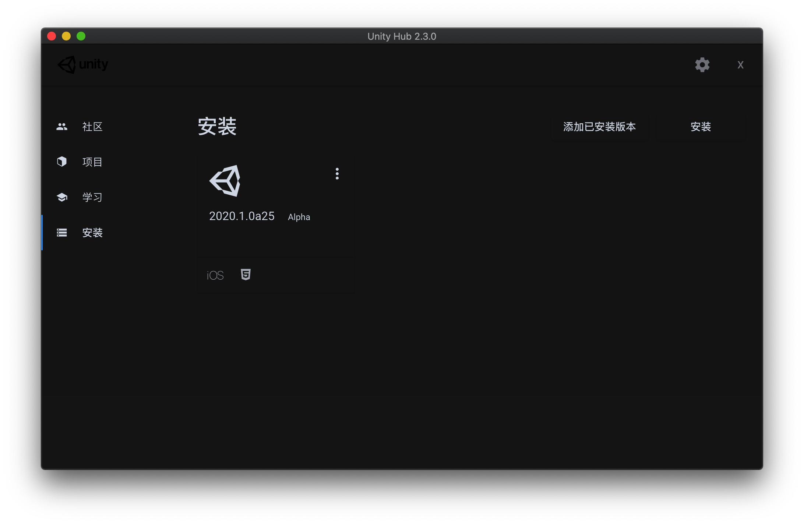

# Unity Hub Dark Mode

I test it on macOS ,It should work on Windows too.





## Install

- Replace the 'app.asar' file

You can found the `app.asar` file in the `/Applications/Unity Hub.app/Contents/Resources`

- Make title bar to be dark 

Open Terminal.app, then input

```bash
defaults write com.unity3d.unityhub NSRequiresAquaSystemAppearance 0
```

## How to build your owe dark theme

- install asar

```bash
npm i -g asar
```

- unpack app.asar file

You can found the `app.asar` file in the `/Applications/Unity Hub.app/Contents/Resources`

```bash
asar extract app.asar app
```

- Change the style

Add `DarkUnityHub.css` to `client/dist/index.html` &`client/dist/index-new-project.html`

- Pack you file

```bash
asar pack app app.asar
```

- Replace the app.asar file
