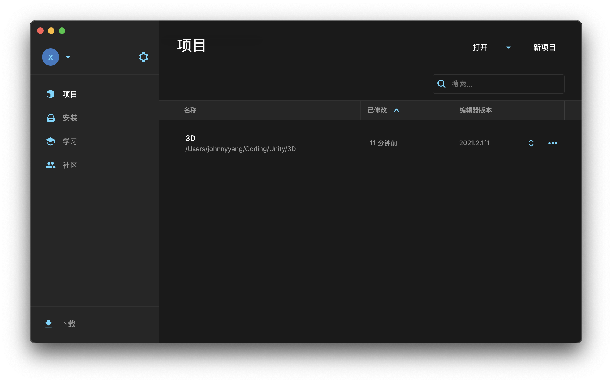
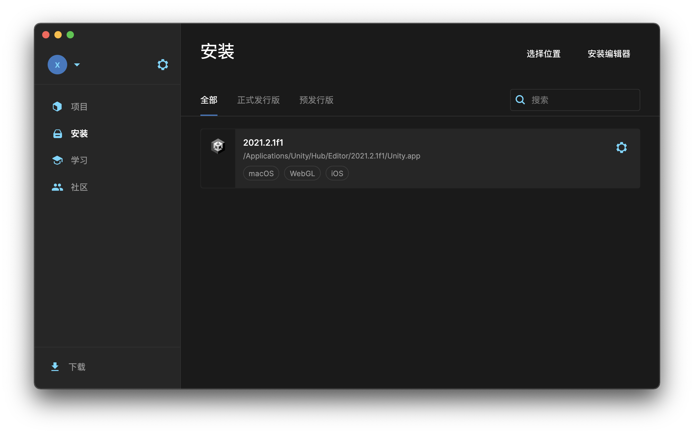
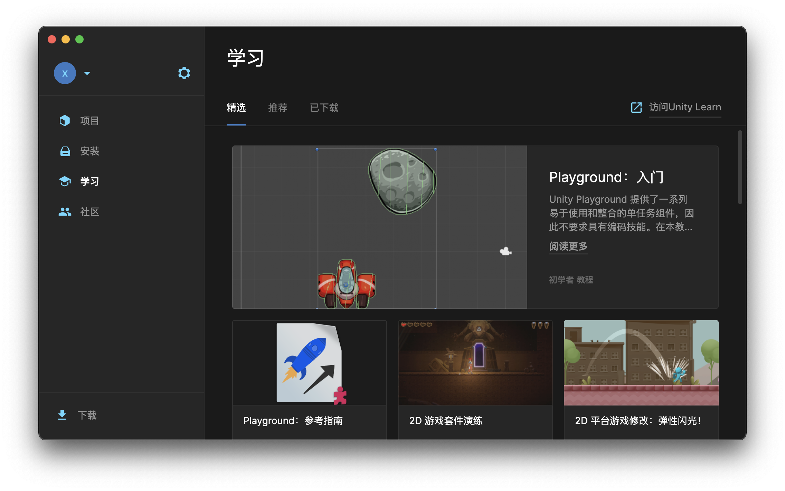

# Unity Hub Dark Mode

I test it on macOS ,It should works on Windows too.






## Install

-   Replace the 'app.asar' file

You can found the `app.asar` file in the `/Applications/Unity Hub.app/Contents/Resources`

## How to build your own dark theme

-   install asar

```bash
npm i -g asar
```

-   unpack app.asar file

You can found the `app.asar` file in the `/Applications/Unity Hub.app/Contents/Resources`

```bash
asar extract app.asar app
```

-   Change the style

Add `Custom.css` to `/build/renderer/index.html`

-   Pack you file

```bash
asar pack app app.asar
```

-   Replace the app.asar file

## License

MIT
